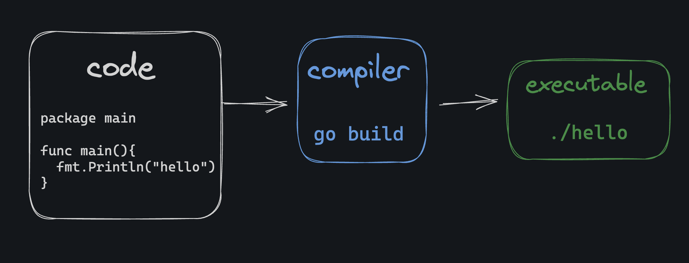
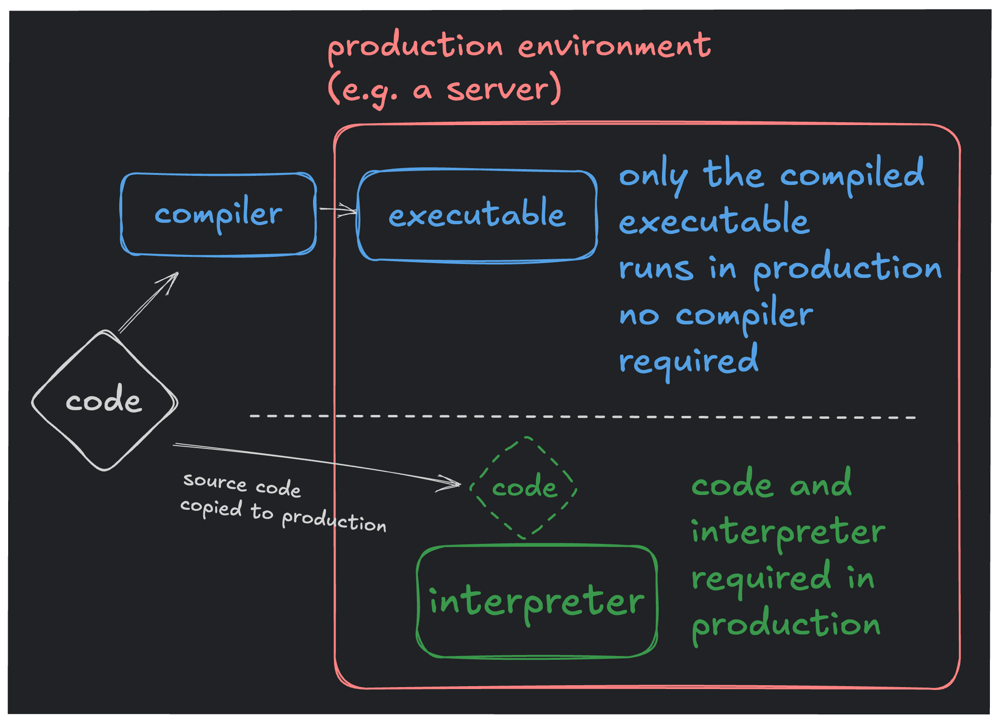

# The Compilation Process

## Go Program Structure

1. `package main` lets the Go compiler know that we want this code to compile and run as a standalone program, as opposed to being a library that's imported by other programs.

2. `import "fmt"` imports the fmt (formatting) package from the standard library. It allows us to use `fmt.Println` to print to the console.

3. `func main()` defines the `main` function, the entry point for a Go program.

## Two Kinds of Bugs

1. Compilation errors. Occur when code is compiled. It's generally better to have compilation errors because they'll never accidentally make it into production. You can't ship a program with a compiler error because the resulting executable won't even be created.

2. Runtime errors. Occur when a program is running. These are generally worse because they can cause your program to crash or behave unexpectedly.

# Fast and Compiled

Generally speaking, languages that compile directly to machine code produce programs that are faster than interpreted programs. However, Go programs don't run quite as fast as its compiled Rust, Zig, and C counterparts.

# Compiled vs. Interpreted

# Small Memory Footprint

Each program includes a small amount of extra code that's included in the executable binary called the _Go Runtime_. One of the purposes of the Go runtime is to clean up unused memory at runtime. It includes a garbage collector that automatically frees up memory that's no longer in use.
