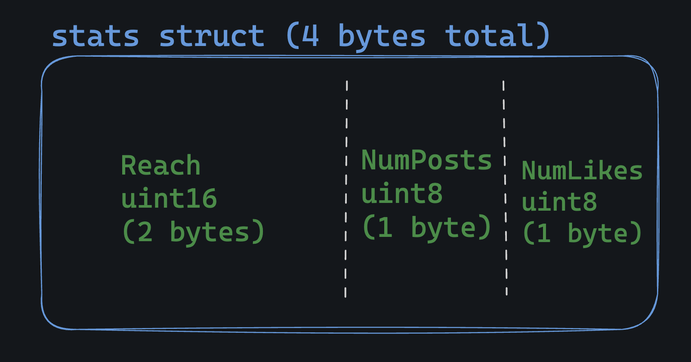
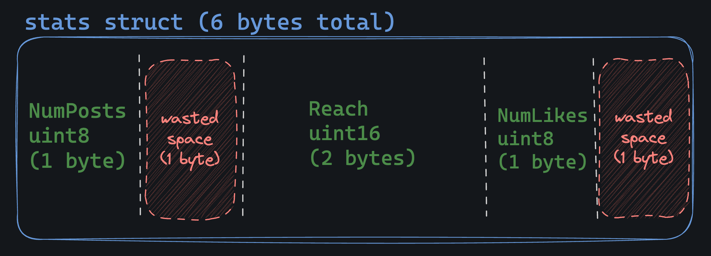
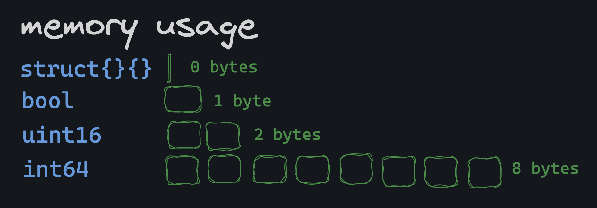

# Memory Layout

In Go, structs sit in memory in a contiguous block, with fields placed one after another as defined in the struct. For example this struct:

```go
type stats struct {
	Reach    uint16
	NumPosts uint8
	NumLikes uint8
}
```

Looks like this in memory:



## Why does it matter?

The order of fields in a struct can have a big impact on memory usage. This is the same struct as above, but poorly designed:



Notice that Go has "aligned" the fields, meaning that it has added some padding (wasted space) to make up for the size difference between the uint16 and uint8 types. It's done for execution speed, but it can lead to increased memory usage.

You can also use the reflect package to debug the memory layout of a struct:

```go
typ := reflect.TypeOf(stats{})
fmt.Printf("Struct is %d bytes\n", typ.Size())
```

More about: [memory layout](https://go101.org/article/memory-layout.html)

# Empty Struct

They're the smallest possible type in Go: they take up zero bytes of memory.


